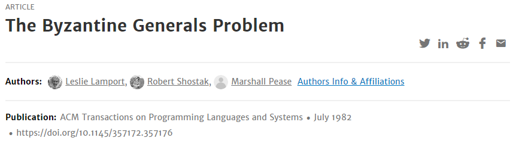

# Byzantine Generals Problem

## 분산시스템과 블록체인

과거에는 한개의 컴퓨터로 모든 작업을 수행할 수 있었지만 시간이 지나면서 하나의 머신의 컴퓨팅 자원 이상을 필요로 하는 작업이 등장했다. 분산 시스템은 이런 작업을 처리하기 위해 여러 컴퓨터가 같이 동작하는 시스템이다. 빅테크 기업들의 데이터 센터는 엄청난 수의 서버들이 서로 협력하여 일을 처리한다.

블록체인은 분산시스템과 유사하다. 나중에 다시 설명하겠지만, 블록체인은 기본적으로 탈중앙화 시스템\(decentralized system\)이다. 블록체인 네트워크에 속한 노드들이 서로 결과를 보고 합의하는 블록체인 시스템은 기존의 분산 시스템 분야에서의 연구를 바탕으로 발전했다.

## 레슬리 램포트와 비잔티움 장군 문제

레슬리 램포트는 분산 시스템의 아버지라고 불리는 컴퓨터 공학자이다. 램포트는 분산 시스템에 대한 전반적인 연구를 진행했다. 분산 시계, 팩소스 알고리즘, 전자서명 등의 논문을 발표했다. 그 외에도 2013년에 튜링상을 수상했고, LaTeX\(레이텍\)을 만든 업적이 있다.

그 중 한 논문\([http://people.cs.uchicago.edu/~shanlu/teaching/33100\_wi15/papers/byz.pdf](http://people.cs.uchicago.edu/~shanlu/teaching/33100_wi15/papers/byz.pdf)\)은 비잔티움 장군 문제에 대하여 다룬다.

### 비잔티움 장군 문제의 개요

비잔티움의 부대는 여러 분대로 나뉘어 적군을 둘러 싸고 있다. 각 분대는 각 분대의 장군이 지휘한다. 장군은 전령을 통해서 다른 분대의 장군과 소통할 수 있다. 적군의 동태를 살펴보고 장군은 서로 통신해서 공격할지 말지 하나의 합의점에 도달해야 한다. 하지만 장군 중 몇명은 이들이 합의에 도달하지 못하도록 하는 배신자이다.

비잔티움 문제에는 두가지 규칙이 있다. 아래 두 규칙을 만족하는 알고리즘을 찾아야한다.

1. 충성스러운 장군은 같은 행동을 취해야한다. 즉, 충성스러운 장군은 다같이 공격하거나 다같이 후퇴한다. 배신자들은 마음대로 행동해도 상관없다.
2. 적은 수의 배신자들이 충성스러운 장군들이 잘못된 결정을 하게 하면 안 된다.

논문에 의하면 이 조건은 결국 아래의 조건으로 바꿔 말할 수 있다. \(논문 참고\)

1. v\(i\)를 자신이 알고있는 i번째 장군의 결정이라고 한다면, 모든 장군은 서로 같은 v\(i\)를 가져야한다.
2. 만약 i번째 장군이 충성스러운 장군이라면, 그가 보낸 메세지와 v\(i\)는 일치해야 한다.

여기서 i번째 장군을 사령관\(commander\)라고 부르면 결국 비잔티움 장군 문제는 아래와 같이 정리된다.

### 비잔티움 장군 문제

사령관은 그의 부하 n-1명에게 명령을 전달하는데, 아래를 만족해야 한다. 어떻게 메세지를 주고 받아야할까?

1. 모든 충성스러운 부하는 같은 명령을 수행하고,
2. 사령관이 충성스럽다면, 모든 충성스러운 부하는 그 명령에 따른다.

### 렘포트의 해법

렘포트는 논문에서 구두 메세지\(Oral Message\), 서명된 메세지\(Signed Message\)의 경우에 대한 해법을 제시한다. 자세한 내용은 논문에서 살펴보자.

## 비잔티움 문제와 블록체인은 무슨 상관? 

비잔티움 문제에서 사령관의 명령을 인풋\(Input\), 부하를 프로세서\(processors\), 배신자를 오작동하는 프로세로 바꿔보면 비잔티움 문제는 올바른 인풋을 받은 프로세서는 오작동하는 프로세가 있더라도 항상 올바른 아웃풋을 도출해야 함을 다루고 있음을 알 수 있다.

더 나아가서 비잔티움 문제에서 사령관의 명령을 거래\(transaction\), 부하를 블록체인 네트워크에 참여한 노드\(Node\) 혹은 컴퓨터, 배신자를 공격자\(Hacker\) 보면 비잔티움 문제는 블록체인에서 공격자가 소수 존재하더라도 노드가 단 하나의 합의를 도출하는 것에 대한 문제로 볼 수 있다. 

블록체인은 이 문제를 해결하는 하나의 해법이다.


블록체인만이 이 문제를 해결하는 것이 아니다. 환경에 따라 여러가지 변수가 존재하고 \(참여하는 노드들이 얼마나 많은 지, 네트워크가 끊겨도 복구되어야 하는지 등...\) 이에 따라서 합의를 도출하는 방법 또한 달라진다. 


참고:  
[http://www.distributedsystemscourse.com/](http://www.distributedsystemscourse.com/)

Last update: 04/07/2021

