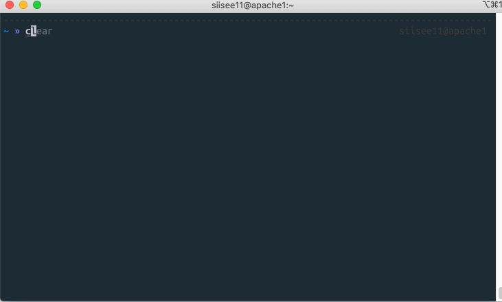
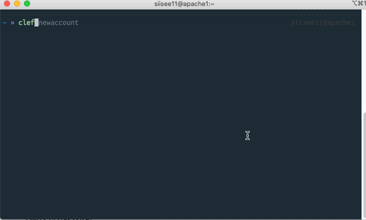
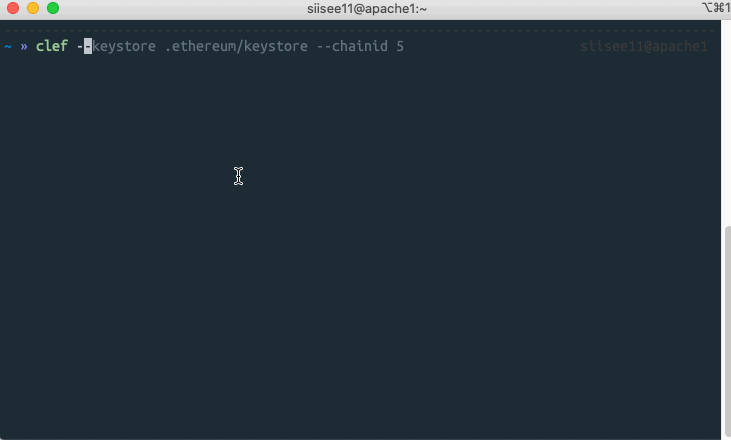
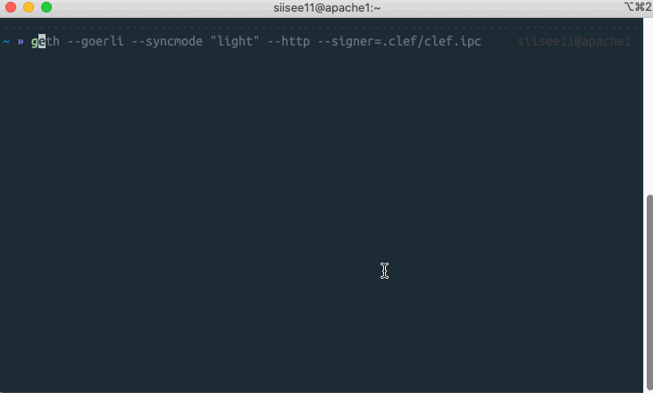
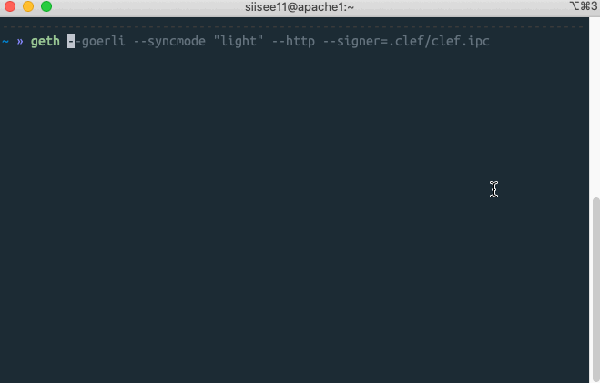
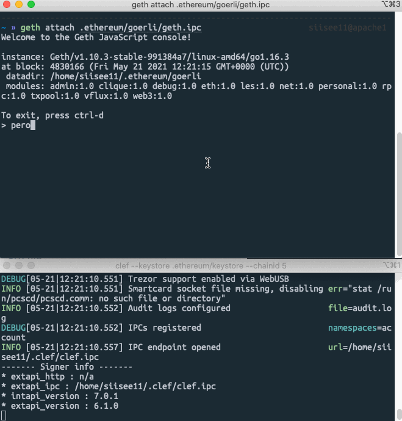

# Geth

Go ethereum은 Ethereum protocol을 Go언어로 구현한 것이다. \([https://github.com/ethereum/go-ethereum](https://github.com/ethereum/go-ethereum)\) 링크에 오픈소스로 공개되어 있다. Geth는 Go ethereum의 클라이언트로 ethereum 네트워크에서 노드를 동작시키는 역할을 한다. 노드를 동작 시킨다는 것은 ethereum 블록체인 위에서 거래를 하거나 스마트 컨트랙트와 상호작용하는 것을 의미한다.

본 실습에서는 geth를 이용해 ethereum 테스트 네트워크\(Görli\)에 접속하고 트랜잭션을 발생시키는 것을 목표로 한다. 이더리움 메인넷에 접속하여 실할 수도 있지만, ~~글을 읽는 대부분의 사람들은 진짜 이더리움을 가지고 있지 않을 것 이기에~~  편하게 실습하기 위해서 테스트넷을 이용하였다.

Ethereum 진영에서 geth와 account 관리를 분리하려고 clef라는 account 관리 툴을 만들고 있다. 본 실습에서는 clef를 이용하도록 한다.

## Geth 설치

geth 설치는 운영체제마다 다릅니다. 

맥과 우분투에서 설치방법만 설명하겠습니다. 다른 운영체제는 아래 링크를 확인해서 설치해주세요.



맥OS의 경우는 아래와 같이 설치한다. \(development 버전은 문서 참조\)

```text
brew tap ethereum/ethereum
brew install ethereum
```

우분투의 경우는 아래와 같이 설치한다.

```text
sudo add-apt-repository -y ppa:ethereum/ethereum
sudo apt-get update
sudo apt-get install ethereum
```

## Clef 셋업

clef를 아래와 같이 initialize 합니다. 

```text
clef init
```



clef를 통해 새로운 계정을 생성한다.




Failed to reload keystore contents 라는 문구가 뜰 것인데 이는 이 후 과정을 수행하면 해결된다.


## Start Clef

clef와 연결할 네트워크를 지정하여 clef를 실행한다. \(Görli의 네트워크 chain ID는 5이다.\)

```text
clef --keystore <GETH_DATA_DIR>/keystore --chainid 5
```



clef는 이제 계정 관련된 요청\(주소, 서명 등\)이 IPC나 RPC 통신으로 도착하면 처리해줄 것이다. 

## Start geth

다른 터미널을 열고 signer를 방금 오픈한 clef.ipc로 하여 geth를 실행한다.

```text
geth --goerli --syncmode "light" --http --signer=<CLEF_LOCATION>/clef.ipc
```



## Connecting to Geth

Geth와 IPC로 통신할 수 있는 콘솔을 실행시켜보겠습니다.

```text
geth attach <IPC_LOCATION>
```



 console을 연결했으니 간단하게 계정의 주소를 가져오는 상호작용을 해보겠습니다. geth 콘솔에서 명령어를 입력하면 IPC를 통해 clef에 요청되고 clef에서 승인을 하면 정보를 가져올 수 있습니다.

```text
> personal.listAccounts
```



## Get ether

테스트 네트워크이므로 테스트용 ether를 제공받을 수 있습니다. 위의 계정 중 하나의 계정에 ether를 받아옵니다. 아래 링크에 접속해서 주소를 입력하면 됩니다. 

## Send transaction

받은 eth를 다른 계정으로 보내봅니다.

```text
> eth.sendTransaction({from:"<ADDRESS_0>",to:"<ADDRESS_1>", value: web3.toWei(0.01,"ether")})
> web3.fromWei(eth.getBalance("<ADDRESS_1>"),"ether")
```


Last updated: May 21, 2021

